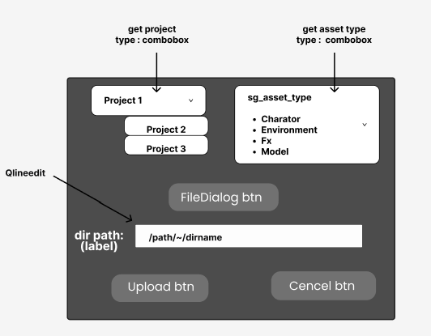
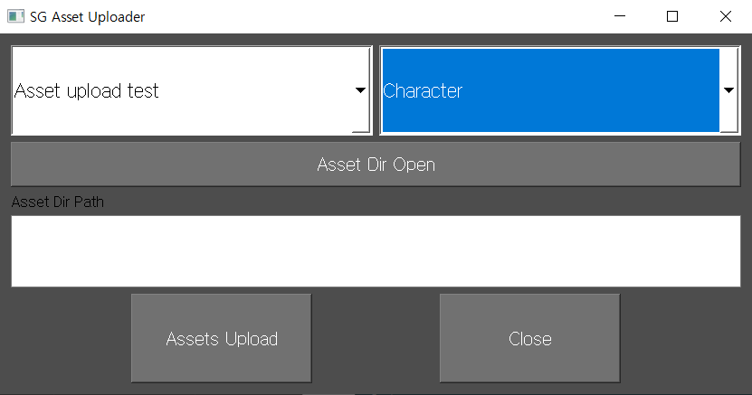

# Asset Uploader v0.0.1

첫 shotgun api & ui 

* start date : 2023.04.11 (화)

  * 기본 기능 구현 완료 : 2023.04.13 (목)
  * UI 수정 : 2023.04.15 (화)
  * MVC 대공사 : 2023.04.24 (월)
  * MVC 정리완료 & git open : 2023.04.25 (화)
***
로컬에 Asset들이 있는 폴더를 선택하면 폴더안의 모든 에셋(파일)을 샷그리드에 업로드한다.
***
## How to use

1. 프로젝트를 콤보박스에서 선택한다.
2. Asset  types 콤보박스 에서 type 을 선택한다.
3. Asset dir open 버튼클릭하여 샷그리드에 업로드할 에셋파일들이 있는 디렉토리를 선택한다.
4. Asset Upload 버튼을 클릭하면 선택한 프로젝트와 asset type 으로 디렉토리안의 모든 파일들이
   샷그리드에 에셋이 업로드된다. 
5. close 버튼은 ui 창이 닫힌다. 

***
## UI 구성
#### 
* Figma Mockup

* main window

